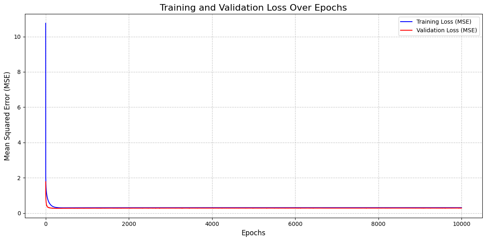
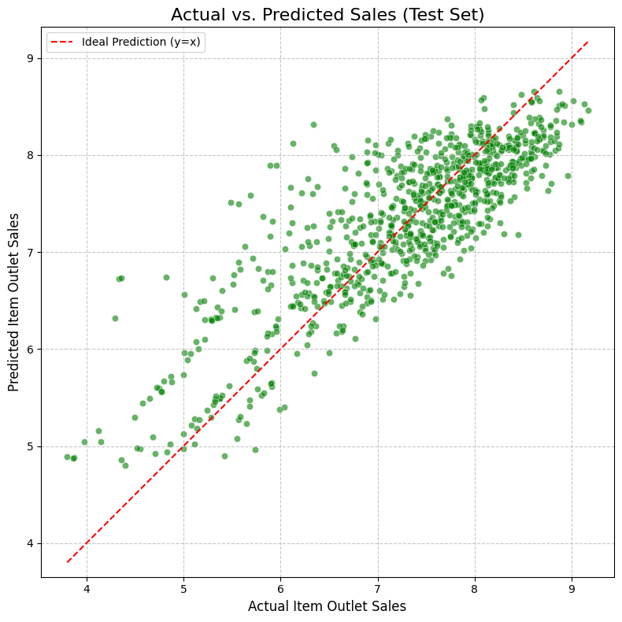

# 🏪 Big Market Outlet Sales Prediction

## 📌 Overview
This project is a **regression task** aimed at predicting outlet sales for products sold across multiple stores using a **Neural Network model**.  
It follows a complete machine learning workflow starting from data preprocessing to model optimization and evaluation.

The dataset used is **Big Mart Sales Prediction Dataset** from Kaggle.

---

## 🎯 Problem Definition
Predict the **outlet sales** of items based on multiple product and store-related features.

**Evaluation Metrics:**
- MSE
- MAE
- RMSE
- R² Score

---

## 📊 Dataset Information
- **Source:** Kaggle – Big Mart Sales Prediction
- **Number of Products:** 1559
- **Number of Stores:** 10
- **Number of Features:** 11
- **Target Variable:** Outlet Sales (continuous value)
- **Format:** CSV

### Features Used
['Item_Weight', 'Item_Visibility', 'Item_MRP',
'Outlet_Establishment_Year',
'Item_Identifier_Encoded',
'Item_Fat_Content_Encoded',
'Item_Type_Encoded',
'Outlet_Identifier_Encoded',
'Outlet_Size_Encoded',
'Outlet_Location_Type_Encoded',
'Outlet_Type_Encoded']

### Data Split
- Training Set: 60%
- Validation Set: 15%
- Testing Set: 15%

---

## 🛠 Data Preprocessing

### 1️⃣ Data Cleaning
- Standardized inconsistent categorical values  
  - `Item_Fat_Content`: LF, low fat → Low Fat
  - `Outlet_Size`: MEdium, SMALL, HIGH → Medium, Small, High

### 2️⃣ Missing Values Handling
- **Item_Weight:** Imputed using mean per `Item_Identifier`
- **Outlet_Size:** Imputed using mode per `Outlet_Type`

### 3️⃣ Handling Inconsistent Values
- `Item_Visibility`: Zero values replaced with mean
- Negative values in `Item_Weight` converted to absolute values

### 4️⃣ Outliers Handling
- Used **IQR method**
- Applied **clipping** to:
  - Item_Weight
  - Item_Visibility

---

## ⚙ Feature Engineering
- **Label Encoding** for all categorical features
- Original categorical columns were dropped
- **StandardScaler** applied to all input features

---

## 📈 Exploratory Data Analysis (EDA)
- Missing values check
- Duplicate check
- Descriptive statistics
- Categorical feature analysis

---

## 🧠 Model Architecture

| Layer | Neurons | Activation | Purpose |
|------|---------|------------|--------|
| Hidden Layer 1 | 128 | ReLU | Feature extraction |
| Hidden Layer 2 | 64 | ReLU | Deeper representation |
| Hidden Layer 3 | 32 | ReLU | Dimensionality reduction |
| Output Layer | 1 | Linear | Sales prediction |

- **Weight Initialization:** He Initialization
- **Loss Function:** Mean Squared Error (MSE)
- **Regularization:** L2 Regularization

---

## 🔧 Training Details
- Optimizer: Mini-Batch Gradient Descent + Momentum
- Batch Size: 42
- Epochs: 10000
- Metric: R² Score

---

## ✅ Results (Optimized Model)

| Metric | Value |
|------|------|
| MSE | 0.3022 |
| MAE | 0.4216 |
| RMSE | 0.5497 |
| R² Score | 0.7189 |

---

## 🚀 Model Improvements
- Mini-Batch Gradient Descent for stable training
- Momentum to accelerate convergence
- L2 Regularization to reduce overfitting

---

## 📌 Observations & Conclusion
- Model performance significantly improved after applying **Momentum**, **L2 Regularization**, and **Mini-Batch training**
- Neural Networks proved effective for tabular regression problems
- The final model achieved strong generalization on the test set

---

## 📉 Training & Validation Loss

## 📊 Actual vs Predicted Sales

## 👩‍💻 Team Members
- [Basmala ElKady](https://github.com/Basmala-ElKady)
- [Menna Hossny](https://github.com/Mennatullah122)
- [Hoda Mahmoud](https://github.com/HodaMahmoud-2005)
- [Jana Hegazy](https://github.com/janahegazy)
- [Jowairya Kassem](https://github.com/jowairyakassem)
- [Hany Ziad](https://github.com/hanyzead123)

---

## 📚 References
- Kaggle: Big Mart Sales Prediction Dataset

